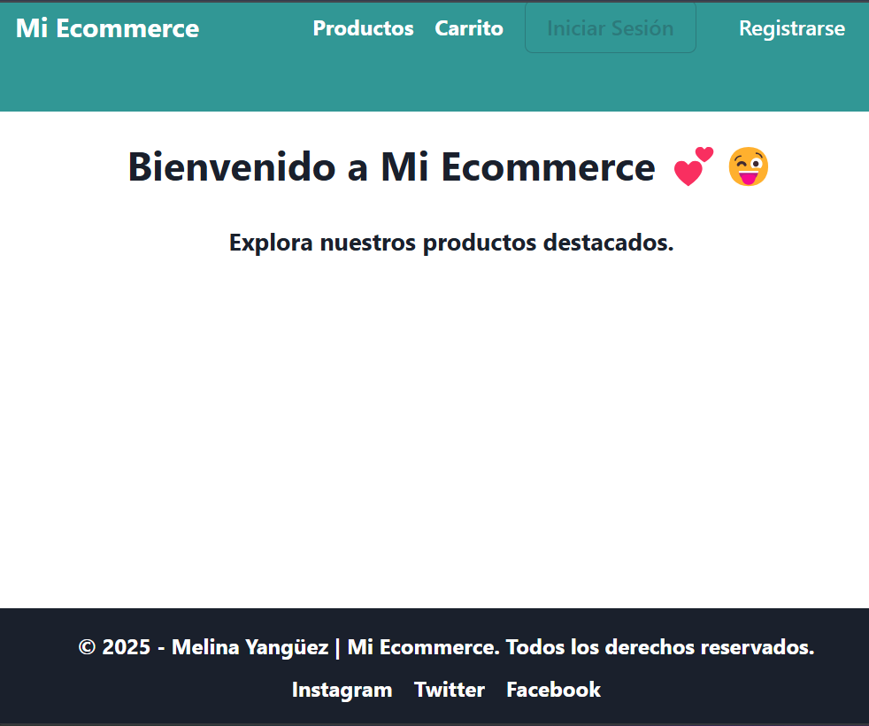
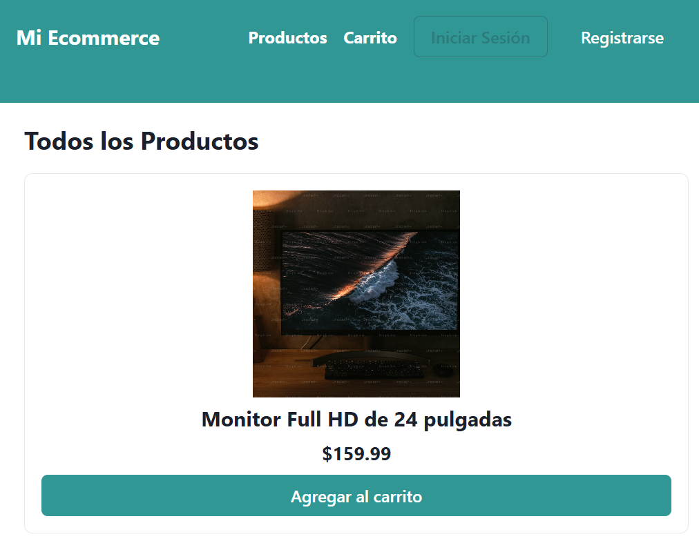
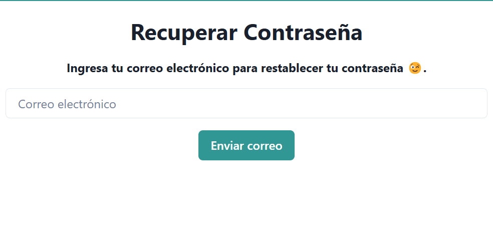
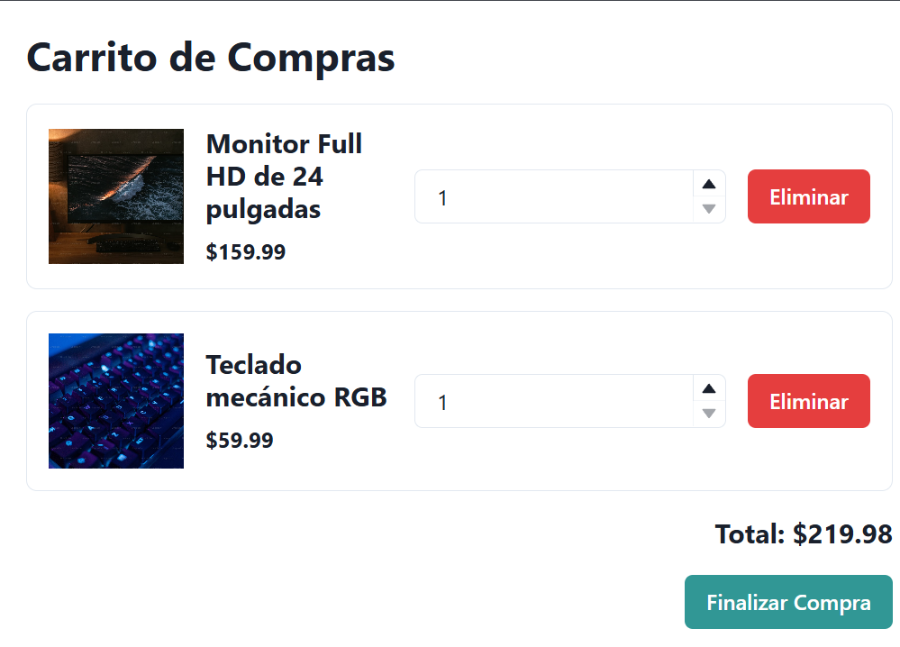

Comenzando 🚀

# Ecommerce con React, Chakra UI y Firebase 🛒

Este proyecto es un ecommerce desarrollado con **React**, **Chakra UI** para los estilos, y **Firebase** como backend. Incluye funcionalidades como autenticación de usuarios, carrito de compras, historial de compras y más.

---

## **Tabla de Contenidos**📑

1. [Requisitos](#requisitos)
2. [Instalación](#instalación)
3. [Configuración de Firebase](#configuración-de-firebase)
4. [Estructura del Proyecto](#estructura-del-proyecto)
5. [Dependencias](#dependencias)
6. [Despliegue](#despliegue)
7. [Capturas de Pantalla](#capturas-de-pantalla)
8. [Autora](#autora)
9. [Agradecimientos](#agradecimientos)
10. [Licencia](#licencia)

---

## **Requisitos**📋

Antes de comenzar, asegúrate de tener instalado lo siguiente:

- [Node.js](https://nodejs.org/) (v16 o superior)
- [npm](https://www.npmjs.com/)
- Una cuenta en [Firebase](https://firebase.google.com/)

---

## **Instalación** 🔧

Sigue estos pasos para configurar el proyecto en tu máquina local:

1. Clona el repositorio:

   git clone https://github.com/tu-usuario/tu-repositorio.git

2. Navega al directorio del proyecto:
    cd tu-repositorio

3. Instala las dependencias:
    npm install

4. Configura Firebase (ver la siguiente sección).

5. Inicia el servidor de desarrollo:
    npm run dev

6.Abre tu navegador y visita:
    http://localhost:5173

## **Configuración de Firebase**🔥

1. Crea un proyecto en Firebase Console.

2. Configura Firebase Authentication (correo/contraseña) y Firestore Database.

3. Obtén las credenciales de Firebase (apiKey, authDomain, projectId, etc.).

4. Crea un archivo .env en la raíz del proyecto y agrega las siguientes variables de entorno:

    VITE_API_KEY=TU_API_KEY
    VITE_AUTH_DOMAIN=TU_AUTH_DOMAIN
    VITE_PROJECT_ID=TU_PROJECT_ID
    VITE_STORAGE_BUCKET=TU_STORAGE_BUCKET
    VITE_MESSAGING_SENDER_ID=TU_MESSAGING_SENDER_ID
    VITE_APP_ID=TU_APP_ID

5. Asegúrate de que las reglas de Firestore permitan lectura/escritura para usuarios autenticados:

rules_version = '2';
service cloud.firestore {
  match /databases/{database}/documents {
    match /{document=**} {
      allow read, write: if request.auth != null;
    }
  }
}

## **Estructura del Proyecto**🗂️
/src
|-- /components
|   |-- Header.jsx
|   |-- Footer.jsx
|-- /context
|   |-- AuthContext.jsx
|   |-- CartContext.jsx
|-- /pages
|   |-- Home.jsx
|   |-- ProductList.jsx
|   |-- ProductDetail.jsx
|   |-- Checkout.jsx
|   |-- Login.jsx
|   |-- Register.jsx
|   |-- Profile.jsx
|   |-- NotFound.jsx
|-- /services
|   |-- config.js
|-- App.jsx
|-- main.jsx

## **Dependencias**📦
El proyecto utiliza las siguientes dependencias principales:

React: Biblioteca para construir interfaces de usuario.

React Router DOM: Manejo de rutas en la aplicación.

Chakra UI: Librería de componentes UI para estilos.

Firebase: Backend para autenticación y base de datos.

Vite: Bundler y servidor de desarrollo rápido.

Puedes ver todas las dependencias en el archivo package.json.

## **Despliegue**🚀

Netlify

1. Conecta tu repositorio a Netlify.

2. Configura las variables de entorno en Netlify (las mismas que en .env).

3. Agrega un archivo _redirects en la carpeta public con el siguiente contenido:

    /* /index.html 200

4. Netlify detectará automáticamente el proyecto y lo desplegará.

Vercel

1. Conecta tu repositorio a Vercel.

2. Configura las variables de entorno en Vercel.

3. Vercel detectará automáticamente el proyecto y lo desplegará.

## **Capturas de Pantalla**📸

## **Autora** ✒️

Melina Yangüez - https://github.com/melina8444/e-commerce_2025.git

## **Agradecimientos** 🎁

Ada ITW: Por enseñarme y ayudarme a crecer día a día.

Cintia Páez: Por todo lo enseñado y aprendido en este proyecto.

⌨️ con ❤️ por Melina Yanguüez 😊